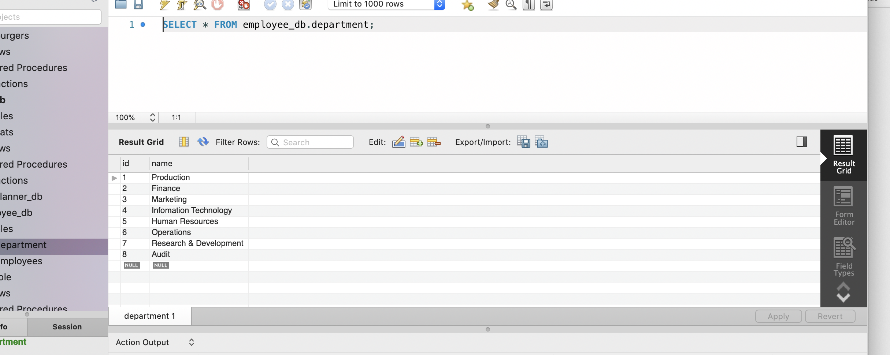
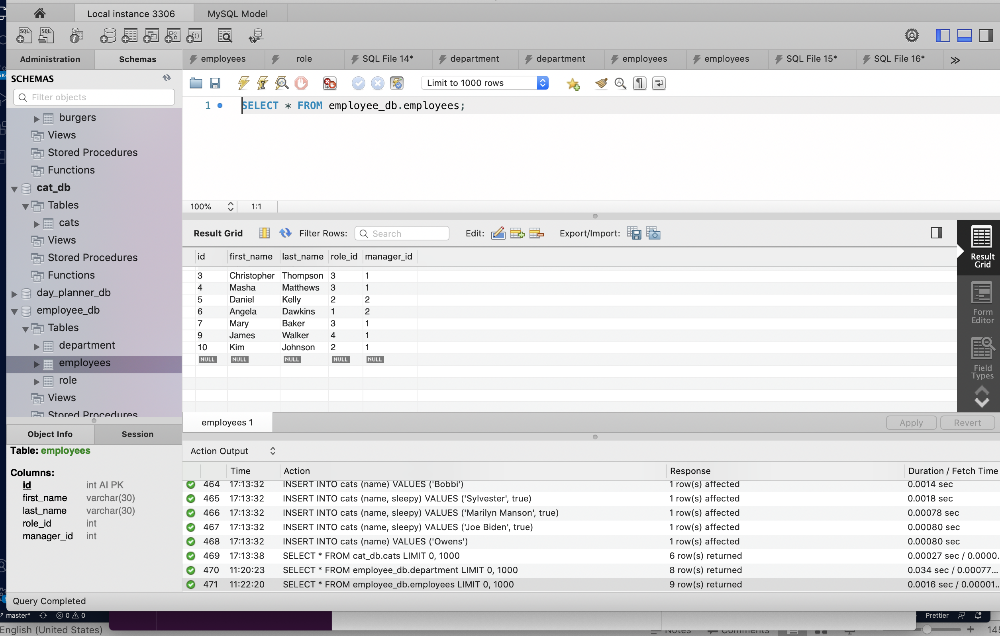
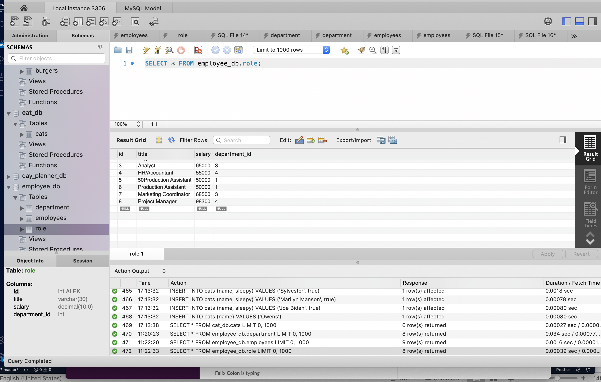

#  Project Title: Employee_Tracker

## Badges: 

  
 

## User Story 

* AS a user, I want to be able to manage and maintain a company database where the user can view, add, delete, update and track all the employees of a specific corporation.

## Technology

- MySQL
- Nodejs
- Inquirer

## Description: 

* Build a command-line application that at a minimum allows the user to:
    - Add departments, roles, employees
    - View departments, roles, employees
    - Update employee roles

* Additional 
    - View employees by manager
    - Delete employees

## Table of Content: 

* [Installation](#installation)  
* [Usage](#usage)
* [License](#license)
* [Contributors](#contributors)
* [Tests](#tests)
* [Questions](#questions)

## Installaion:
* npm i

## License: 
* MIT
# Contributing: 
* Pull request and stars are always welcome.
## Testing: 
* N/A

## Questions
If you have any questions, please contact at:   
Email: carolenesw@gmail.com

## link

* Repo link:
https://github.com/Carolenesw/Employee_Tracker

<!-- * Deployed URL: https://notestake.herokuapp.com/ -->

## Images

